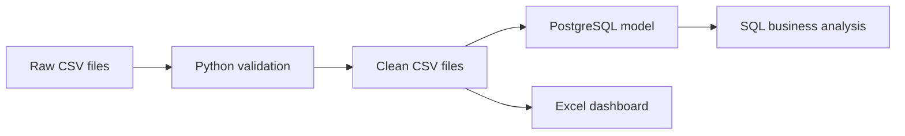

# JK Retail Intelligence MVP

A portfolio-ready Data and AI foundation project for **JK AI Innovation**. It models a common small-retail problem in Myanmar: owners purchase through memory and shelf observation while product-level profit, stock position, fast sellers, and stockout risk remain unclear.

> Data notice: all included transactions are realistic **synthetic data** generated for learning and demonstration. They are not verified transactions from a real Myanmar retailer.

## Business outcome

The MVP turns product, supplier, sales, purchase, and inventory data into:

- five-day revenue and gross-profit reporting;
- product and category performance;
- low-stock and reorder recommendations;
- slow-moving-product identification;
- data-quality reports and rejected records;
- a management workbook for nontechnical users.

## Architecture



## Repository structure

```text
data/raw/                 generated source data with deliberate defects
data/processed/           clean data, rejected rows, KPI outputs
docs/                     discovery, process, dictionary, metrics, evidence
sql/                      PostgreSQL schema and business queries
src/                      generator and processing pipeline
tests/                    automated validation tests
outputs/                  workbook and preview
```

## Quick start

```bash
python -m venv .venv
source .venv/bin/activate       # Windows: .venv\Scripts\activate
pip install -r requirements.txt
python src/generate_data.py
python src/pipeline.py
python -m unittest discover -s tests -v
```

Optional PostgreSQL:

```bash
docker compose up -d
psql -h localhost -U jk_user -d jk_retail -f sql/schema.sql
psql -h localhost -U jk_user -d jk_retail -f sql/analysis_queries.sql
```

Before starting PostgreSQL, copy `.env.example` to `.env` and set a private local password. The `.env` file is excluded from Git.

## Core business definitions

- Revenue = quantity sold × selling price − discount
- Estimated COGS = quantity sold × recorded unit cost
- Gross profit = revenue − estimated COGS
- Gross margin = gross profit ÷ revenue
- Estimated stock = latest count + purchases after count − sales after count
- Reorder point = average daily units × supplier lead time + safety stock
- Suggested reorder quantity = max(0, target stock − estimated stock)

These are management estimates, not audited accounting results. Cost and inventory accuracy depend on complete transaction capture.

## Evidence produced

The project demonstrates business analysis, data capture, spreadsheets, SQL, Python/pandas, data modeling, statistics, KPIs, visualization, Git-ready documentation, PostgreSQL, data quality, and testing.

See [docs/PILOT_GUIDE.md](docs/PILOT_GUIDE.md) to replace synthetic data with a real 20–50 product shop pilot.
